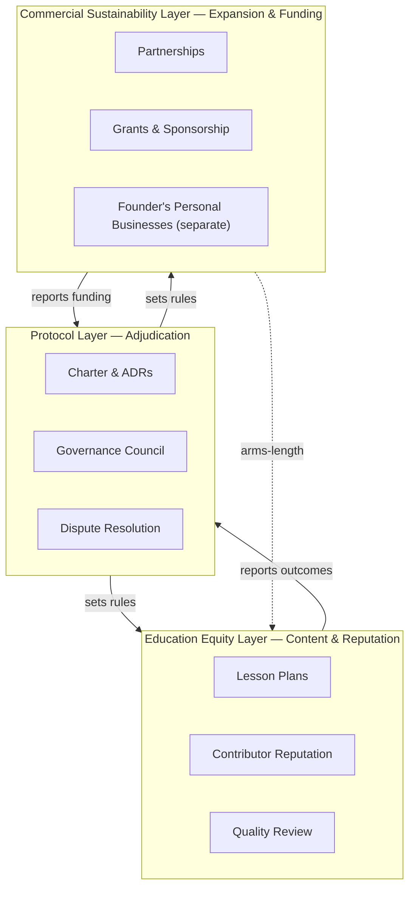
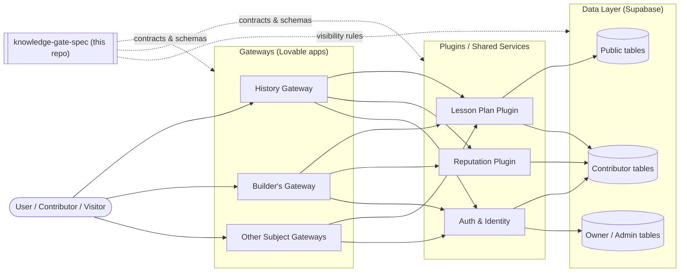

# Knowledge Gate — Architecture Overview

> Status: Draft v0.1 · Authoritative diagram of how layers, gateways, plugins, and data flow.
> Source of truth: this document. Lovable projects render from these contracts.

---

## 1. Three-Layer Power Structure

Knowledge Gate is governed by three independent layers. No layer can unilaterally override the others; changes that touch more than one layer require an ADR.

See `/00-charter/governance.md` for the formal definitions.

---

## 2. Runtime Topology (Gateways + Plugins + Data)

The ecosystem is organized as a small set of **Gateways** (Lovable web apps the public sees) and a shared **Plugin/Service** layer. Everything reads from one canonical data store.

---

## 3. Visibility & Trust Boundaries

Four visibility tiers, defined in `/00-charter/data-charter.md`:

| Tier        | Who can read                | Examples                                  |
|-------------|-----------------------------|-------------------------------------------|
| Public      | Everyone                    | Charter, ADRs, published lesson plans     |
| Contributor | Verified contributors       | Drafts, peer reviews, reputation history  |
| Owner       | Resource owner only         | Personal notes attached to a lesson       |
| Admin       | Governance Council          | Audit logs, dispute records               |

---

## 4. Source of Truth

- **This repository** is the canonical spec (see ADR-001).
- **Lovable projects** render the spec; they do not define it.
- **Supabase** stores runtime data under the visibility rules above.
- **Founder's personal businesses** are explicitly outside this diagram.

---

## 5. Change Process

1. Open an issue describing the proposed change.
2. If it touches ≥2 layers, write an ADR in `/02-decisions/`.
3. Update this overview and any affected charter docs in the same PR.
4. Merge to `main` only after Council review.

---

_Last updated: 2026-05-10_
